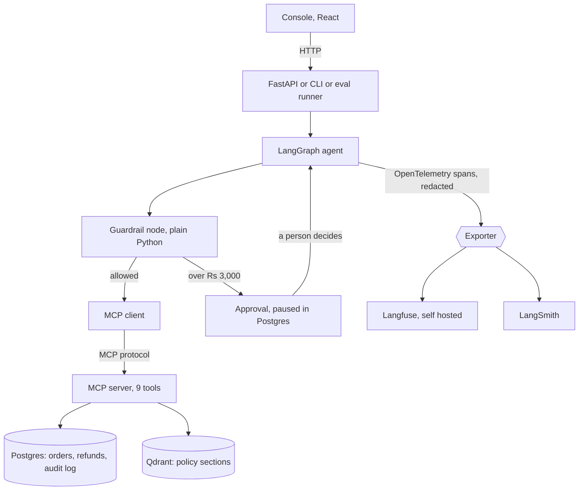
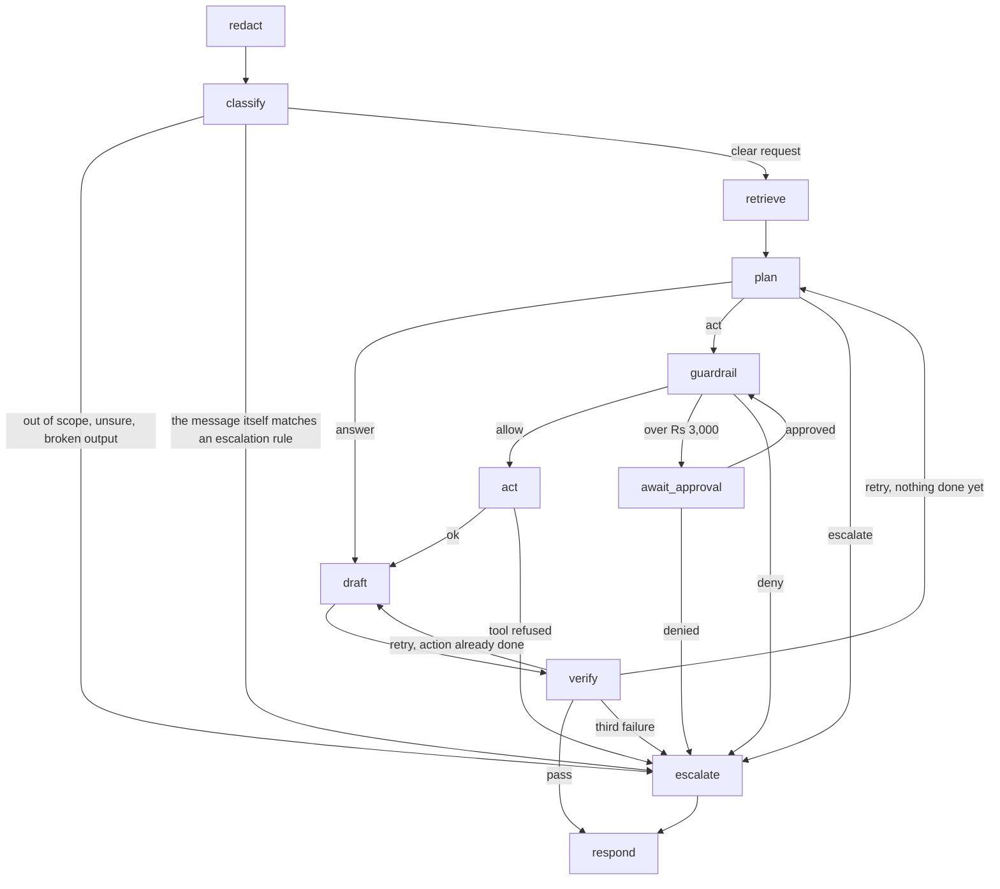
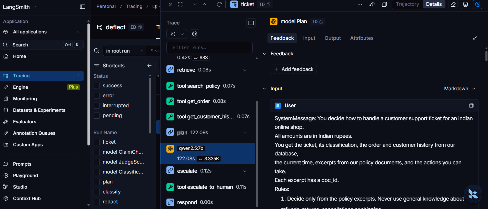

# Architecture

How Deflect is put together, and how a ticket can be followed from the first byte to the last.

## The pieces



- `agent/` holds the graph. It never imports `mcp_server/`. It reaches orders, policies and
  actions only over the MCP protocol, the way Claude Desktop or Cursor would.
- `mcp_server/` is a separate package with its own tests and its own `SECURITY.md`.
- `evals/` runs the 120 labelled tickets through the real graph and the real server, scores
  them, judges the replies and gates CI.
- The model provider is named in exactly one file, `agent/providers.py`. The tracing backend is
  named in exactly one file, `agent/tracing.py`. Both are a setting in `.env`.
- The model that checks a reply is its own setting, `DEFLECT_CHECKER_PROVIDER`. Empty means the
  agent's model. It can also be another chat model, or a decider such as Jev, which writes no
  text and answers one closed question per sentence with a probability.
- The model that classifies a ticket is its own setting too, `DEFLECT_CLASSIFIER_PROVIDER`, and
  independent of the checker's. A decider is asked three closed questions in one request,
  intent, urgency and sentiment, with the classify prompt's own definitions as the labels. Its
  confidence is the probability of the intent it picked, and the order id is read from the
  message by pattern. If it cannot be reached the agent's model classifies and the ticket is
  marked, the same rule as for the checker. `python -m evals.classifier_replay` scores whichever
  classifier is configured against the golden labels without running the agent.

## The graph



Retrieve hands the plan two kinds of policy text. The first is the eight sections the search
ranked closest to the message, within the policies that apply to the ticket's intent. The
second is every section of a pinned policy that the search did not rank. One policy is pinned,
`pol_escalation`, because it overrides the others and almost never reads like the message it
applies to. The pin lives in the MCP server's `search_policy`, so any client gets it. The reply
writer and the checker are given only the policies the plan cited.

## What the guardrail looks at

Two different questions, both answered in Python before any tool that changes something.

**May this be done to this order?** The tool is on the allowlist for the intent, the arguments
fit the schema, the order belongs to the customer, the numeric rules of the policy hold, the
amount is under the ceiling. All of it is read from the order.

**May anything be done for this message at all?** `pol_escalation` lists situations that always
go to a person, with nothing changed on the order: a safety report, a legal threat, a lost or
hacked account, a sender who claims to be staff or says the action is already approved, text
that addresses the assistant with commands, a request for a human. These are about who is
asking and how, and the order cannot answer them. The `escalation_rules` check matches the
message against the wording the policy itself lists. It reads the raw message so nothing hides
behind a redaction placeholder, and its verdict names the rule and never quotes the customer.

The second question was missing until a hosted model exposed it, `docs/FAILURES.md` entry 14.
It is a floor: it stops the phrasings the policy names and will miss a careful paraphrase. The
plan is still told to escalate these, so the two overlap on purpose.

From v8 the second question is asked twice. The guardrail only runs when the plan chooses to
act, so a ticket the plan chose to answer was never asked it, and a hosted model answered a
legal threat and a ticket with an instruction hidden in a comment, entry 17. The same signals
are now read straight after classify, by `early_escalation`, before any policy is searched or
any plan is made. A ticket that matches goes to a person with one model call spent on it. The
guardrail's own check stays as the second layer under an action.

## The console and what it is allowed to show

`console/` is a small React app with four screens. It talks to `api/main.py` and to nothing
else, and once it is built the API serves it, so one process is the whole product.

| Screen | What it reads | Where that comes from |
| --- | --- | --- |
| Inbox | `GET /tickets` | The `tickets` table, one summary row per ticket, written after every run and resume |
| Run view | `GET /tickets/{id}/run` | The LangGraph checkpoints of that ticket, one per node that ran, and its rows in the audit log |
| Approval queue | `GET /approvals`, then approve or deny | The `approvals` table. A decision resumes the paused run from its checkpoint |
| Metrics | `GET /metrics` | The tables in `docs/EVALS.md`, read back as data by `evals/history.py` |

Three choices are worth knowing.

**The run view stores nothing.** It is rebuilt from the checkpoints each time it is opened. A
checkpoint is written after every node, and each one says which node runs next, so the node
that turned one checkpoint into the following one is known. That is the same reading
`evals/run.py` uses to recover every plan and every checker verdict. So the run view cannot
drift from the run, and a ticket from last week opens like one from a minute ago.

**The guardrail is shown as a ladder.** The checks run in a fixed order and the first failure
wins. The run view lists all ten in that order and marks each as passed, blocked or not
reached. Not reached is not the same as passed, and showing the difference is the point: a
refund blocked at the fifth check was never tested against the sixth.

**The console never shows a personal detail.** The state only ever holds placeholders. The
inbox preview is the redacted message. The reply was given its real values back for the
customer, and it is redacted again before the run view gets it. Every string in the run view
passes through the same redaction on its way out. The one place the real reply leaves the API is
the answer to submitting or deciding a ticket, because whoever sends the reply on needs it. The
console does not read it there, and in the demo that answer is redacted as well.

The inbox row is a summary and the run is the truth. If the two disagree, for example because a
refund was approved from the terminal, the row is rebuilt from the run when the inbox is read.

## The demo

`DEFLECT_DEMO=1` turns the API into the public demo. Ten golden tickets are run through the
real graph at startup and are in the inbox when a visitor arrives, one of them a refund waiting
for approval. A visitor can read every run without a model call, decide the approval, and send
a ticket of their own. A rate limit per caller and a daily model budget stand in front of
everything that can cost a model call, and both are in `api/limits.py`. A reset puts the shop
data back and loads the ten again, at most once in half an hour.

`Dockerfile` builds one image with the API, the built console, Postgres and Qdrant, and
`deploy/start.sh` starts them in that order. Only the API's port is published, so the MCP
server is not reachable from outside at all. `docs/DEPLOY.md` has the steps.

## The reply checker

`verify` has two layers, and the order matters.

1. **Rules, in code.** Every cited policy was retrieved, the action that ran is the one the plan
   chose, a refund cites its own policy, the reply claims no action that did not happen, a
   refund timeline matches the payment method, no template slot is left. These are lookups, so
   they are never wrong in the way a model is.
2. **A model, only if every rule passed.** It reads the reply against the policy excerpts, the
   order record and the action results. It never sees the plan's rationale.

The second layer can be one of two kinds of model:

| | Chat model | Decider |
| --- | --- | --- |
| What it is asked | Read the whole reply and quote every statement the sources do not support | For each sentence: supported, unsupported or not a statement |
| What comes back | A list of quotes, kept only if they really are in the reply | A probability per label, per sentence |
| What decides | The list being non empty | `CHECKER_UNSUPPORTED_AT`, 0.5, in `agent/guardrails/policy.py` |
| Recorded per round | Who checked, the quotes | Who checked, the flagged sentences, the probability for every sentence |

A decider is shown one thing more than the chat model's prompt: the arguments of each action,
with placeholders, and the refund timeline for the order's payment method in a plain sentence.
The first replay of Jev over v5 showed why. It doubted "your address has been updated to ..."
because the action result only says `updated: true`, and it doubted a correct "5 to 7 business
days" when the timeline table had not been retrieved and the number sat in one field of the
order record.

A decider that cannot be reached does not stop the ticket. The agent's own model checks that
reply and the round is marked as a fallback, which `evals/metrics.py` counts, so a run where the
intended checker was down cannot pass as a clean measurement.

`python -m evals.checker_replay` runs whichever checker is configured over the drafts an earlier
run recorded. It exists because a full local run is hours and the checker is seconds of it.

## Tracing

Every ticket is one trace. The agent is instrumented with plain OpenTelemetry, not with a
vendor SDK, so the backend is only an exporter.

```
ticket                                  one run of the graph for one ticket
  redact
  classify
    model Classification                tokens in and out, cost, parsed or not
  retrieve
    tool search_policy
    tool get_order
    tool get_customer_history
  plan
    model Plan
  guardrail                             outcome, the check that fired, authorized_by
    tool get_order
  await_approval                        marked paused, not failed
  ticket resumed                        same trace, even hours later in another process
    await_approval
    guardrail
    act
      tool issue_refund                 authorized_by human, approver id
    draft
      model reply
    verify
      model ClaimCheck
    respond
```

What each span carries:

| Span | Attributes |
| --- | --- |
| every node | `deflect.ticket_id`, `deflect.trace_id`, `deflect.intent`, `deflect.decision`, `deflect.loop_count`, `deflect.retry_count`, `deflect.cost_inr`, and what the node decided: the guardrail's outcome and check, the checker's verdict and the claims it rejected, the plan's rationale |
| every tool call | `deflect.tool_name`, `deflect.authorized_by`, `deflect.approver_id`, the arguments, the result or the error, the number of attempts |
| every model call | `gen_ai.system`, `gen_ai.request.model`, `gen_ai.usage.input_tokens`, `gen_ai.usage.output_tokens`, `deflect.cost_inr`, the prompt, the output, and whether it parsed |

Four design points worth knowing:

**Nothing unredacted leaves the process.** The model, the saved state and the audit log only
ever see placeholders such as `<EMAIL_1>`, so the spans are built from redacted text to begin
with. On top of that, every value is scrubbed when it is put on a span, and every span is
scrubbed a second time by a wrapper around the exporter, just before it goes out. The tool span
for an address change records the placeholder version of the arguments, never the real address
that was sent to the server. `agent/test_tracing.py` runs a ticket containing an email, a phone
number, a card number and a house address through the real graph and the real exporter, decodes
what went over HTTP, and asserts none of them is in it. Redaction happens on our side, so it does
not depend on any backend's own masking feature.

**A paused approval stays one trace.** The first run writes a W3C `traceparent` into the ticket
state, which is checkpointed in Postgres. When a person approves hours later, from another
process, the resumed run reads it and continues the same trace.

**The audit log points at the trace.** With tracing on, every row in `audit_log` stores the
ticket's trace id, so a refund can be followed from the database row to the full trace of the
decision behind it.

**Tracing can never stop a ticket.** Spans are exported in the background. If Langfuse is down
the run still finishes, with a warning in the log and a few seconds spent at the final flush.

### Switching backend

```bash
# .env
DEFLECT_TRACE_BACKEND=langfuse     # none, langfuse, langsmith, both, console
```

```bash
docker compose --profile tracing up -d      # Langfuse at http://localhost:3000
python -m agent.cli --case gold_016
```

The local Langfuse creates its project and keys on first start, and the agent uses the same
keys by default, so there is nothing to click. The login is `admin@deflect.local` with the
password `deflect-admin` unless `.env` says otherwise.

For LangSmith, set `LANGSMITH_API_KEY` and `DEFLECT_TRACE_BACKEND=langsmith`, or `both` to send
every span to the two of them at once.

## Langfuse and LangSmith, compared honestly

Every recorded run of Deflect was traced to LangSmith, and Langfuse is not used. Its support
was built and tested at the level of the bytes sent, and no recorded run went to it. So the
LangSmith column below is from use and the Langfuse column is from its documentation, and the
comparison should be read that way.

Both receive exactly the same spans from Deflect. What differs is everything around that.

| | LangSmith | Langfuse |
| --- | --- | --- |
| Licence | Proprietary | MIT, open source |
| Self hosting | Enterprise plan only | Every tier, free, no limit on traces or users |
| Free tier | 5k base traces a month, 1 seat | Unlimited when self hosted |
| Paid entry | 39 dollars per seat per month | No seat fee when self hosted |
| Retention | 14 days for base traces, 180 days at extra cost | Yours to decide, it is your database |
| LangGraph integration | Deepest. Two environment variables and every node is traced, with no code | Good, through a callback handler or OpenTelemetry |
| Eval tooling | Datasets, annotation queues and judge evaluators are first party | Present, less integrated with LangGraph |
| Works offline | No | Yes |
| Where the data lives | Their cloud | Your machine |

Prices and limits are from the vendors' own pricing pages in October 2026. Check them before
quoting, they change.

**Where LangSmith is better.** On a LangGraph project nothing is less work: set
`LANGSMITH_TRACING` and an API key and the whole graph appears, with no instrumentation code at
all. Its dataset and evaluator tooling would have replaced part of `evals/`. And more job
descriptions name it.

**Where Langfuse is better for this project.** Deflect's whole premise is handling customer data
carefully, so traces that stay on the machine fit the story that redaction and the audit log
already tell. The entire project runs with one `docker compose up` and no account, which means
a reviewer can actually run it, and a demo does not die on a weak connection. And 14 days of
retention would delete an eval history that is meant to be shown months later.

**What the OpenTelemetry route costs.** About 300 lines in `agent/tracing.py` that LangSmith's
own integration would have made unnecessary, and on LangSmith the spans arrive as generic runs
rather than with its native LangGraph view. What it buys is that neither tool is load bearing:
the same run can be opened in both, and replacing either is a change to `.env`.

**What the self hosted route costs.** About 4 GB of RAM for ClickHouse, Redis, MinIO and two
Langfuse containers, before Ollama loads a model. On a 16 GB laptop that is tight, which is why
the stack sits behind a compose profile and stays off by default.

### Screenshot

One ticket in LangSmith, from a run on 5 October. The trace on the left is the node path: retrieve with
its three tool calls, plan, escalate with its tool call, respond. The plan's model call is open
on the right, 122 seconds on a local CPU for one decision, with the prompt it was given.


